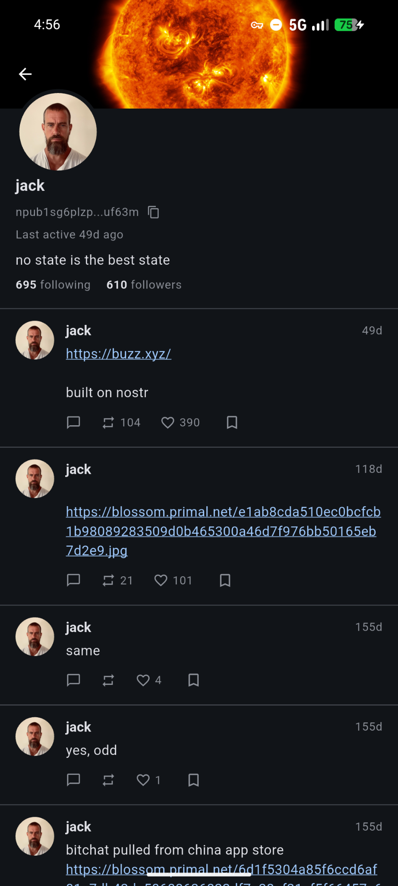
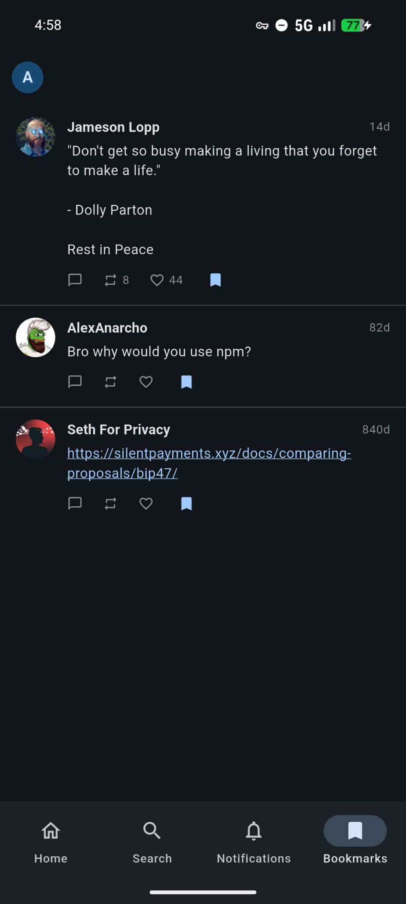

# sputnik

A minimal, cross-platform Nostr client. Highly WIP.

## Features

- Not bloated (compared to other clients)
- Reasonably good performance
- Support for [payment targets](https://github.com/nostr-protocol/nips/blob/master/A3.md)
- Licensed under MIT

## Screenshots

| Profile page                            | Bookmarks page                          |
| --------------------------------------- | --------------------------------------- |
|  |  |
